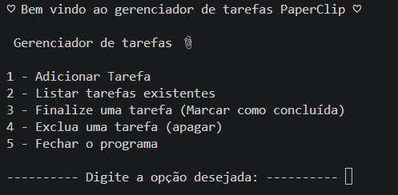
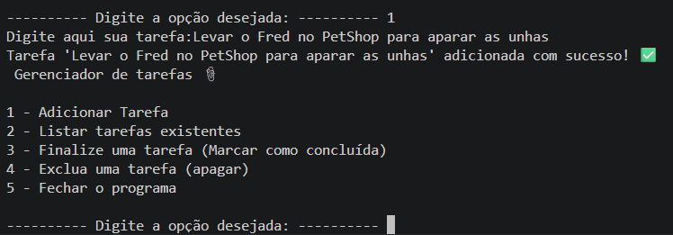
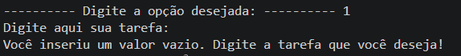
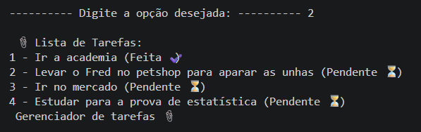
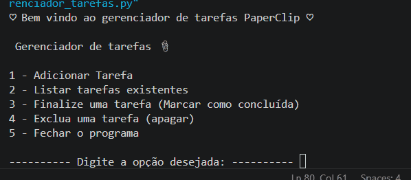

# Projeto gerenciador de tarefas

# 📎 PaperClipTasks

Um gerenciador de tarefas de linha de comando, desenvolvido em Python, com persistência de dados em um banco de dados PostgreSQL.

Este projeto foi criado como parte do meu processo de aprendizado em Python e bancos de dados relacionais, evoluindo de uma versão simples em memória até uma aplicação conectada a um banco de dados real.

##  Funcionalidades

-  Adicionar novas tarefas;
-  Listar todas as tarefas cadastradas, com status (pendente/concluída);
-  Marcar uma tarefa como concluída;
-  Deletar uma tarefa;
-  Persistência de dados via PostgreSQL — as tarefas não se perdem ao fechar o programa;
-  Validação de entradas e tratamento de erros de conexão.

##  Tecnologias utilizadas

- **Python 3**
- **PostgreSQL** — banco de dados relacional
- **psycopg2** — biblioteca de conexão entre Python e PostgreSQL
- **python-dotenv** — gerenciamento seguro de variáveis de ambiente

##  Estrutura do projeto

```
paperclip-tasks/
├── gerenciador_tarefas.py   # Arquivo principal — interface de menu com o usuário
├── conexaoDataBase.py       # Funções de conexão e operações com o banco de dados
├── .env.example              # Modelo das variáveis de ambiente necessárias
├── .gitignore
└── README.md
```

##  Como rodar o projeto localmente

### Pré-requisitos

- [Python 3.10+](https://www.python.org/downloads/) instalado
- [PostgreSQL](https://www.postgresql.org/download/) instalado e rodando

### Passo a passo

1. **Clone o repositório**
   ```bash
   git clone https://github.com/SasaMoreira/paperclip-tasks.git
   cd paperclip-tasks
   ```

2. **Instale as dependências**
   ```bash
   pip install psycopg2-binary python-dotenv
   ```

3. **Crie o banco de dados e a tabela**

   No PostgreSQL (via pgAdmin ou terminal), crie um banco de dados e rode:
   ```sql
   CREATE TABLE tarefas (
       id SERIAL PRIMARY KEY,
       conteudo_tarefa TEXT NOT NULL,
       esta_feita BOOLEAN DEFAULT FALSE,
       data_criacao TIMESTAMP DEFAULT CURRENT_TIMESTAMP
   );
   ```

4. **Configure as variáveis de ambiente**

   Copie o arquivo de exemplo e preencha com suas credenciais:
   ```bash
   cp .env.example .env
   ```
   Edite o `.env` com os dados do seu banco:
   ```
   DB_HOST=localhost
   DB_NAME=nome_do_seu_banco
   DB_USER=seu_usuario
   DB_PASSWORD=sua_senha
   DB_PORT=5432
   ```

5. **Execute o programa**
   ```bash
   python gerenciador_tarefas.py
   ```

## 📸 Demonstração











## 🧠 Aprendizados e desafios

Durante o desenvolvimento, um dos principais desafios foi o uso da biblioteca psycopg2. Para mim foi difícil entender a lógica de como essa biblioteca pegava as listas de tuplas do database e como que eu ia conseguir manipular esses valores e buscar os dados que eu precisava. Mas essa foi também a parte que eu mais achei interessante, porque você meio que "entra" dentro desse processo de busca, e é como se você pudesse enxergar por trás da mágica dos dados, se torna algo compreensivel e não mais "obscuro".

Também foi um aprendizado importante implementar a prevenção contra **SQL Injection**, utilizando queries parametrizadas (`%s`) ao invés de concatenação direta de strings no SQL. Graças a isso, eu consegui entender o humor dos [Bobby Tables](https://xkcd.com/327/) e  de [outras](https://www.reddit.com/r/ProgrammerHumor/comments/hji1ur/sql_injection/) tirinhas relacionadas a essa prática.


## 🔮 Próximos passos

Algumas melhorias que pretendo implementar no futuro:

- [ ] Interface web interativa (Streamlit)
- [ ] Permitir que o usuário volte sempre que quiser ao menu principal
- [ ] API REST (FastAPI) como camada intermediária
- [ ] Testes automatizados
- [ ] Impedir a conclusão de tarefas já finalizadas

## 👩‍💻 Autor

Desenvolvido por **Sara de Souza Moreira**
GitHub: [github.com/SasaMoreira](https://github.com/SasaMoreira)
LinkedIn: [linkedin.com/in/sarah-souza-435985244/](https://www.linkedin.com/in/sarah-souza-435985244/)
